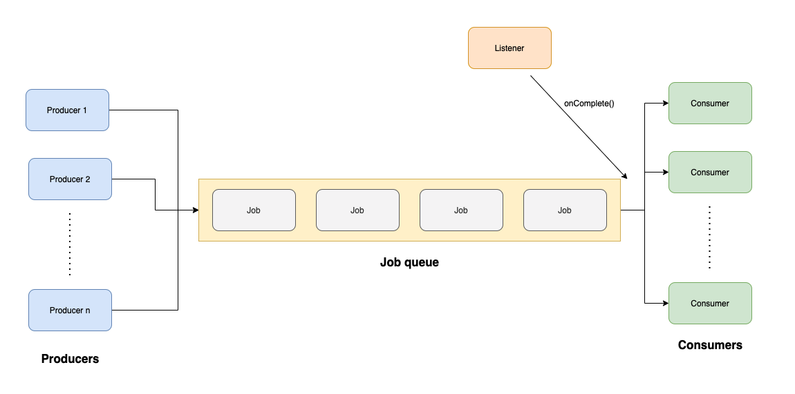

# JOB QUEUING USING BULL

In order to check all the details about this project, I will suggest you to visit the tutorial I did in my [Medium page](https://roluquec.medium.com/) called [Job Queuing 101: Start using Bull in your Node.js Project](https://roluquec.medium.com/job-queuing-101-start-using-bull-in-your-node-js-project-part-i-2be3ef36a42d). 

It is a 2 part tutorial where I explained in detail how to implement your first job queue in a Koa application and adding to it a cool dashboard using the package [bull-board](https://www.npmjs.com/package/@bull-board/koa).

Hope you find it useful! 